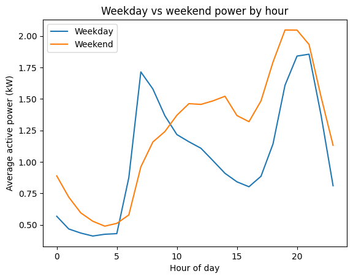

# Household Electric Power Consumption Analysis

An exploratory analysis of almost four years of minute-by-minute electricity use in one home near Paris, France. I wanted to see when the household uses the most power, and how daily and seasonal patterns differ.

## Question
When does a single household use the most electricity, and how do daily and seasonal patterns differ?

## Data
[Individual Household Electric Power Consumption](https://archive.ics.uci.edu/dataset/235/individual+household+electric+power+consumption) (Hebrail & Berard, UCI Machine Learning Repository): about 2 million one-minute readings from December 2006 to November 2010. It includes active and reactive power, voltage, current, and three sub-meters (kitchen, laundry room, and water heater/air conditioner).

## Key findings
- **Daily pattern:** Usage is lowest overnight (about 0.45 kW), has a small morning peak, and peaks in the evening (about 1.9 kW around 7-9 PM).
- **Weekday vs. weekend:** Weekdays have a sharp spike around 7 AM and a quiet daytime. Weekends start later and stay higher through midday.
- **Seasonality:** Usage is highest in winter and lowest in summer, repeating in all four years.
- **Anomaly (August 2008):** Usage dropped far below every other summer. I ruled out missing data (0.0% missing that month), and daily averages showed a flat ~0.2 kW block for about three weeks, consistent with the home being unoccupied. This is my inference, not something the data confirms.
- **What drives the seasonal swing:** The water heater/AC sub-meter is the largest metered load, but the unmetered load (everything not on the three sub-meters) is larger and swings more with the seasons.

## Data cleaning
Missing values were stored as `?`, so a basic null check reported none. After converting the columns to numeric, about 1.25% of rows (25,979) were missing, all across measurements at once. My averages skip these rows.

## Limitations
- This is one household in France, so the patterns may not apply to other homes.
- The first and last months are partial, so I ignored the first data point on the monthly charts.
- The unmetered category can't be broken down further, so explanations for it are hypotheses.

## Tools
Python, pandas, matplotlib, Google Colab

## How to run it
Open `household_power_analysis.ipynb` in Google Colab and choose **Runtime → Run all**. The notebook downloads the dataset automatically using the `ucimlrepo` package.

## What I'd do next
- Build a model to forecast next-day usage for this household
- Find similar datasets from other places and compare usage patterns
- Compare warmer and colder climates to see how heating and cooling change the daily and seasonal shapes
